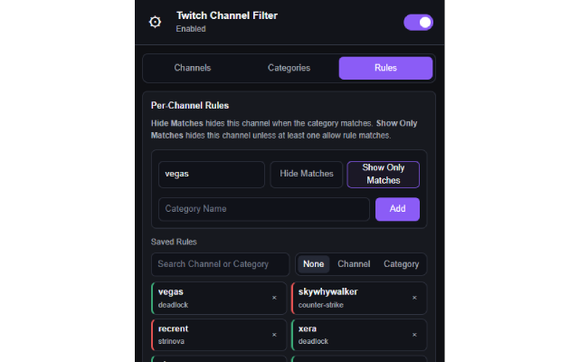

# Twitch Channel Filter

Extension for hiding Twitch channels by channel lists, channel-specific category rules, and global category rules.

## Features

- Hide or always show channels with global channel blocklist and allowlist rules
- Create channel-specific rules based on streamed categories
- Apply global category filters across Twitch channel lists
- Filter Twitch sidebar channels and supported main Twitch pages
- Use partial category matching for more flexible filtering
- Automatically expand Twitch sidebar sections when filtered lists become too short
- Search and manage saved channels, categories, and rules from the popup
- Import, export, and reset local settings

## Rule Priority

1. Channel allowlist/blocklist
2. Channel-specific rules
3. Global category rules

## Supported Pages

- `https://www.twitch.tv/*`

## Privacy

- Settings are stored locally in the browser
- The extension does not collect or send Twitch activity to external servers

## Installation

- 🟢 [Chrome Web Store](https://chromewebstore.google.com/detail/dikaepocanngdpdfmifimimihideofmb)
- 🦊 [Firefox Add-ons](https://addons.mozilla.org/firefox/addon/twitch-channel-filter/)

## Screenshots

**1. Per-channel category rules in the popup**

## Contributing

Feel free to open issues or submit pull requests to improve the extension.
